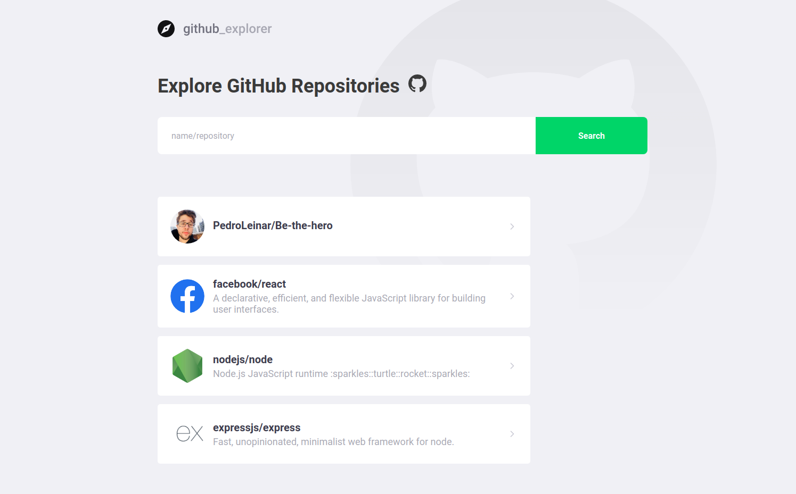
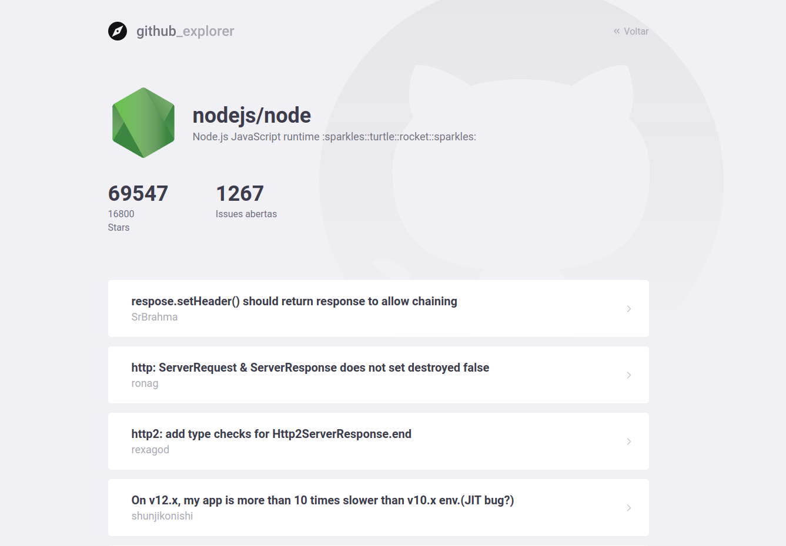

<h1 align="center">
  
</h1>

 ---
 
<h2 align="center">
  GitHub Explorer - see the details of your favorite repositories.
</h2>

 ---
 

  

  

  

  
  
  

  
 ---
 

 ---
 
## 🚀 technologies

- [ReactJS](https://reactjs.org/)
- [TypeScript](https://github.com/microsoft/TypeScript)
- [React Router DOM](https://reacttraining.com/react-router/)
- [React Icons](https://react-icons.netlify.com/#/)
- [Styled Components](https://styled-components.com/)
- [Polished](https://github.com/styled-components/polished)
- [Axios](https://github.com/axios/axios)

---

Feito com ♥ by [Pedro Gomes](https://www.linkedin.com/in/pedroleinar/)

